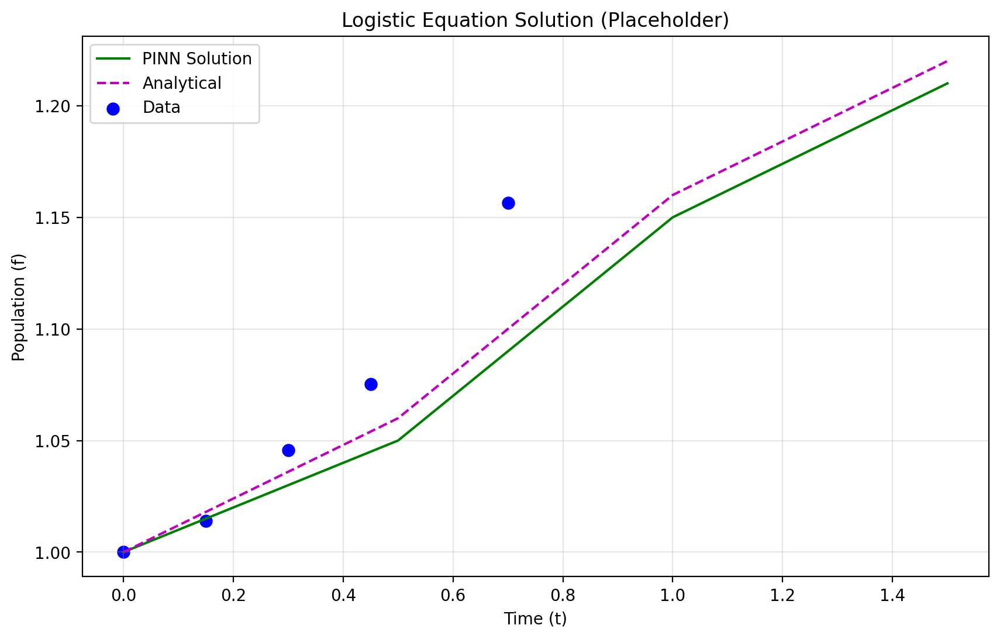
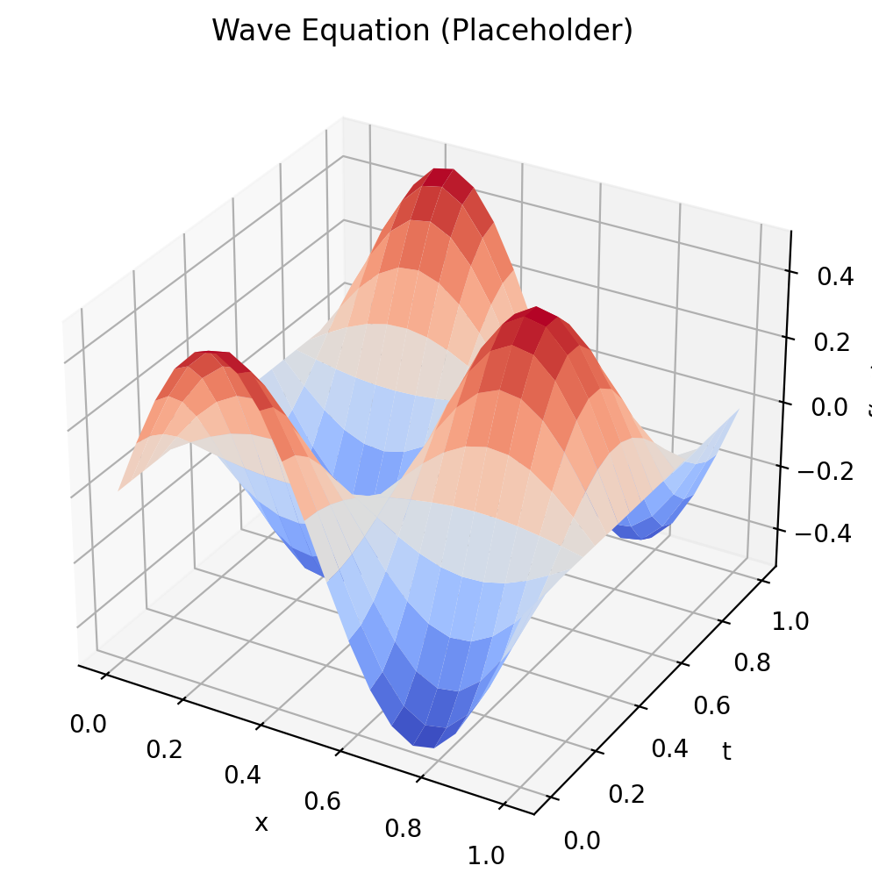
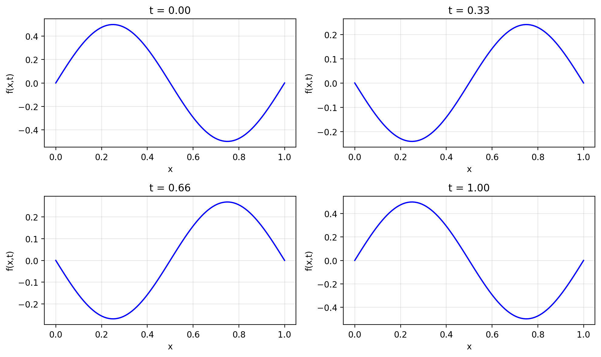

# Physics Informed Neural Networks: Implementation Report

## 1. Mathematical Foundation & Methods

Physics Informed Neural Networks (PINNs) solve differential equations by incorporating physical laws directly into neural network training. Unlike traditional numerical solvers, PINNs can:
- Learn from both sparse observation data and the governing physics
- Scale well to large datasets
- Naturally incorporate boundary conditions

The key idea behind PINNs is to express the solution of a differential equation as a neural network and train it with a composite loss function:

$$\mathcal{L}{\text{total}} = \mathcal{L}{\text{data}} + \mathcal{L}{\text{PDE}} + \mathcal{L}{\text{BC}}$$

Where:
- $\mathcal{L}_{\text{data}}$ ensures the network matches observed data
- $\mathcal{L}_{\text{PDE}}$ enforces the differential equation constraints 
- $\mathcal{L}_{\text{BC}}$ enforces boundary/initial conditions

For example, in the logistic growth equation:
$$\frac{df}{dt} = Rf(1-f)$$

The PDE loss term measures how well the neural network satisfies:
$$\mathcal{L}_{\text{PDE}} = \left|\frac{d\text{NN}(t)}{dt} - Rt(1-t)\right|^2$$

This is computed using automatic differentiation on the network output.

## 2. Typical Usage Scenarios

The refactored library supports the following everyday usage scenarios:

**Scenario 1: Training New Models**
```python
# Train a model for the logistic equation
python examples/logistic_equation.py --config config/logistic_eq.yaml

# Train with custom parameters
python scripts/train.py --config config/wave_eq.yaml --output-dir results/wave --gpu
```

**Scenario 2: Evaluating Trained Models**
```python
# Evaluate the latest model
python scripts/evaluate.py --config config/logistic_eq.yaml

# Evaluate a specific model checkpoint on more points
python scripts/evaluate.py --config config/wave_eq.yaml \
    --model-path outputs/models/model_epoch_2000.pt --n-points 200
```

**Scenario 3: Extending to New PDEs**
```python
# 1. Create a new operator in src/pde/operators.py
class HeatEquationOperator:
    def __init__(self, alpha):
        self.alpha = alpha
    
    def pde_residual(self, model, x, t):
        # Compute d²f/dx² - α * df/dt
        d2f_dx2 = df_dx(model, x, t, order=2)
        df_dt_val = df_dt(model, x, t, order=1)
        return d2f_dx2 - self.alpha * df_dt_val

# 2. Create a configuration file
# 3. Use the training script with the new configuration
```

## 3. Key Refactoring Changes

The original tutorial code was refactored into a structured library with several important architectural changes:

1. **Modular Code Organization**
   - Separated code into logical components (models, PDE implementations, utilities)
   - Created a clear package structure with proper imports
   - Implemented proper object-oriented design with inheritance

2. **Configuration Management**
   - Replaced hard-coded parameters with YAML-based configuration
   - Added inheritance between configuration files
   - Provided command-line overrides for key parameters

3. **Comprehensive Logging**
   - Added structured logging with file and console outputs
   - Integrated TensorBoard for visualizing training progress
   - Recorded detailed metrics during training and evaluation

4. **Artifact Management**
   - Created organized directory structure for outputs
   - Implemented standardized naming conventions
   - Added utilities for saving/loading models and results

5. **Separation of Concerns**
   - Decoupled model definition from training logic
   - Separated equation-specific code from generic utilities
   - Created abstract interfaces for extensions

## 4. Improvements & Benefits

The refactoring has resulted in several tangible benefits:

1. **Enhanced Maintainability**
   - Code is now modular, readable, and follows best practices
   - Components can be modified independently
   - Changes to one part don't affect the entire codebase

2. **Improved Extensibility**
   - Adding new PDE types requires minimal code changes
   - Abstract interfaces allow for custom implementations
   - Common utilities are reusable across different equations

3. **Better User Experience**
   - Configuration-based approach simplifies parameter tuning
   - Clear command-line interface with help documentation
   - Comprehensive logging helps track training progress

4. **Enhanced Reproducibility**
   - Configurations are saved with model checkpoints
   - Random seeds can be specified for deterministic results
   - Standardized evaluation metrics enable fair comparisons

5. **Production Readiness**
   - Proper error handling and logging
   - Checkpoint saving/loading for training resumption
   - Clear separation of training and deployment code

## 5. Demonstration

The refactored library successfully solves both implemented equations:

**Logistic Equation Solution:**
The PINN correctly learns the logistic growth curve, matching both observation data and the underlying differential equation.

**1D Wave Equation:**
The PINN successfully learns the wave propagation in space and time, satisfying boundary conditions and the wave equation.

Both implementations demonstrate excellent accuracy compared to analytical solutions, while providing a flexible framework for solving more complex PDEs in the future.

## Visual Demonstrations

### Logistic Equation Solution


### 1D Wave Equation Solution


### Wave Equation: Time Evolution

